# Bulfighter

Live site: [bulfighter.com](https://bulfighter.com/)

The official source code for **Bulfighter** — a React single-page application with an interactive 3D globe visualisation, animated UI, a serverless contact/email pipeline, and **Pseudodemocracy**, a realtime multiplayer party game played at `/pseudodemocracy` (see [Pseudodemocracy](#pseudodemocracy) below).

## Architecture

Workflow diagram generated by [GitDiagram](https://gitdiagram.com/somunaexe/bulfighter) — click a node to jump to its source file. This covers the marketing site (routes, admin, API/Lambda backend); it predates Pseudodemocracy and doesn't include it.

```mermaid
%% Generated by https://gitdiagram.com/somunaexe/bulfighter
flowchart TD

subgraph group_app["Application routes"]
  node_router["Route dispatcher<br/>[main.jsx]"]
  node_home["Home page<br/>[App.jsx]"]
end

subgraph group_public["Public experience"]
  node_clips["Clip browser<br/>[Clips.jsx]"]
  node_contact["Join application<br/>[Contact.jsx]"]
  node_consent["Consent form<br/>[ConsentForm.jsx]"]
end

subgraph group_admin["Administration"]
  node_admin_page["Admin workspace<br/>[Admin.jsx]"]
  node_interest_admin["Interest management<br/>[Interests.jsx]"]
  node_consent_admin["Consent management<br/>[Consents.jsx]"]
  node_topic_admin["Topic management<br/>[Topics.jsx]"]
end

subgraph group_api["API and backend"]
  node_interest_api["Interest API<br/>[interests.js]"]
  node_topic_api["Topic API<br/>[topics.js]"]
  node_invite_api["Consent invite API<br/>[consentInvite.js]"]
  node_consent_api["Consent API<br/>[consents.js]"]
  node_auth_api["Admin auth API<br/>[adminAuth.js]"]
  node_request_json["JSON fetch helper<br/>[http.js]"]
  node_lambda_endpoints{{"Serverless endpoints"}}
  node_invite_backend["Consent email handler<br/>[inviteToConsent.js]"]
end

node_visitor(("Site visitor"))
node_smtp(("SMTP service"))

node_visitor -->|"opens site"| node_router
node_router -->|"routes to"| node_home
node_router -->|"routes to"| node_clips
node_router -->|"routes to"| node_consent
node_router -->|"routes to"| node_admin_page
node_home -->|"renders"| node_contact
node_clips -->|"loads topics"| node_topic_api
node_contact -->|"creates interest"| node_interest_api
node_consent -->|"validates invite"| node_invite_api
node_consent -->|"submits consent"| node_consent_api
node_admin_page -->|"renders"| node_interest_admin
node_admin_page -->|"renders"| node_consent_admin
node_admin_page -->|"renders"| node_topic_admin
node_admin_page -.->|"authenticates"| node_auth_api
node_interest_admin -->|"loads applicants"| node_interest_api
node_interest_admin -->|"sends invite"| node_invite_api
node_consent_admin -->|"manages consents"| node_consent_api
node_topic_admin -->|"manages topics"| node_topic_api
node_auth_api -->|"uses fetch helper"| node_request_json
node_interest_api -->|"uses fetch helper"| node_request_json
node_topic_api -->|"uses fetch helper"| node_request_json
node_invite_api -->|"uses fetch helper"| node_request_json
node_consent_api -->|"uses fetch helper"| node_request_json
node_interest_api -->|"calls endpoint"| node_lambda_endpoints
node_topic_api -->|"calls endpoint"| node_lambda_endpoints
node_invite_api -->|"calls endpoint"| node_lambda_endpoints
node_consent_api -->|"calls endpoint"| node_lambda_endpoints
node_auth_api -->|"calls endpoint"| node_lambda_endpoints
node_invite_backend -.->|"sends email"| node_smtp

click node_router "https://github.com/somunaexe/bulfighter/blob/main/src/main.jsx"
click node_home "https://github.com/somunaexe/bulfighter/blob/main/src/App.jsx"
click node_clips "https://github.com/somunaexe/bulfighter/blob/main/src/sections/Clips.jsx"
click node_contact "https://github.com/somunaexe/bulfighter/blob/main/src/sections/Contact.jsx"
click node_consent "https://github.com/somunaexe/bulfighter/blob/main/src/sections/ConsentForm.jsx"
click node_interest_api "https://github.com/somunaexe/bulfighter/blob/main/src/api/interests.js"
click node_topic_api "https://github.com/somunaexe/bulfighter/blob/main/src/api/topics.js"
click node_invite_api "https://github.com/somunaexe/bulfighter/blob/main/src/api/consentInvite.js"
click node_consent_api "https://github.com/somunaexe/bulfighter/blob/main/src/api/consents.js"
click node_admin_page "https://github.com/somunaexe/bulfighter/blob/main/src/admin/Admin.jsx"
click node_interest_admin "https://github.com/somunaexe/bulfighter/blob/main/src/admin/Interests.jsx"
click node_consent_admin "https://github.com/somunaexe/bulfighter/blob/main/src/admin/Consents.jsx"
click node_topic_admin "https://github.com/somunaexe/bulfighter/blob/main/src/admin/Topics.jsx"
click node_auth_api "https://github.com/somunaexe/bulfighter/blob/main/src/api/adminAuth.js"
click node_request_json "https://github.com/somunaexe/bulfighter/blob/main/src/api/http.js"
click node_invite_backend "https://github.com/somunaexe/bulfighter/blob/main/src/backend/inviteToConsent.js"

classDef toneNeutral fill:#f8fafc,stroke:#334155,stroke-width:1.5px,color:#0f172a
classDef toneBlue fill:#dbeafe,stroke:#2563eb,stroke-width:1.5px,color:#172554
classDef toneAmber fill:#fef3c7,stroke:#d97706,stroke-width:1.5px,color:#78350f
classDef toneMint fill:#dcfce7,stroke:#16a34a,stroke-width:1.5px,color:#14532d
classDef toneRose fill:#ffe4e6,stroke:#e11d48,stroke-width:1.5px,color:#881337
classDef toneIndigo fill:#e0e7ff,stroke:#4f46e5,stroke-width:1.5px,color:#312e81
classDef toneTeal fill:#ccfbf1,stroke:#0f766e,stroke-width:1.5px,color:#134e4a
class node_router,node_home toneBlue
class node_clips,node_contact,node_consent toneAmber
class node_admin_page,node_interest_admin,node_consent_admin,node_topic_admin toneMint
class node_interest_api,node_topic_api,node_invite_api,node_consent_api,node_auth_api,node_request_json,node_lambda_endpoints,node_invite_backend toneRose
class node_visitor,node_smtp toneIndigo
```



## Tech Stack

**Frontend**
- [React 18](https://react.dev/) + [Vite](https://vitejs.dev/) — app shell and build tooling
- [React Router](https://reactrouter.com/) — client-side routing
- [Tailwind CSS](https://tailwindcss.com/) — utility-first styling
- [date-fns](https://date-fns.org/), [file-saver](https://github.com/eligrey/FileSaver.js/), [react-responsive](https://github.com/yocontra/react-responsive)
- [Framer Motion](https://www.framer.com/motion/) — animation (press feedback, dropdown transitions) in Pseudodemocracy
- [Radix UI](https://www.radix-ui.com/) primitives + a [shadcn/ui](https://ui.shadcn.com/)-style `Button`/`Select` layer (`src/components/ui/`) — accessible interactive components, styled with this site's own tokens
- `class-variance-authority`, `clsx`, `tailwind-merge` — supporting utilities for the component layer above
<!-- - [React Three Fiber](https://docs.pmnd.rs/react-three-fiber) + [Drei](https://github.com/pmndrs/drei) + [Three.js](https://threejs.org/) — 3D rendering
- [react-globe.gl](https://github.com/vasturiano/react-globe.gl) — interactive 3D globe visualisation -->
<!-- - [GSAP](https://gsap.com/) (`@gsap/react`) — animation -->
<!-- - [Leva](https://github.com/pmndrs/leva) — real-time 3D scene tuning controls -->
<!-- - [maath](https://github.com/pmndrs/maath) — math helpers for 3D/animation -->


**Pseudodemocracy (realtime multiplayer)**
- [Firebase](https://firebase.google.com/) — Firestore (realtime game state) + Anonymous Auth, no custom server for game logic (all client-side, see `src/pseudodemocracy/gameEngine.js`)

**Backend / Infra**
- [Express 5](https://expressjs.com/) — API server
- [Nodemailer](https://nodemailer.com/) — transactional email, packaged as an AWS Lambda layer (`nodemailer-layer/`)
- [CORS](https://github.com/expressjs/cors), [dotenv](https://github.com/motdotla/dotenv)
- GitHub Actions (`.github/workflows/`) — CI/CD

**Tooling**
- ESLint (flat config) with React/Hooks/Refresh plugins
- PostCSS + Autoprefixer

## Project Structure

```
Bulfighter/
├── .github/workflows/      # CI/CD pipelines
├── nodemailer-layer/       # AWS Lambda layer for the email/contact backend
├── pseudodemocracy/        # Pseudodemocracy's non-React pieces
│   ├── data/               # Single source of truth: game numbers, articles, cards
│   ├── build/              # Rulebook (.docx) generation tooling
│   ├── testing/            # Node-based chaos-testing bots (no browser needed)
│   └── firestore.rules     # Firestore security rules (hand-published via console)
├── public/                 # Static assets
├── src/                    # React application source
│   ├── pseudodemocracy/    # Game UI, engine, Firestore access (gameEngine.js)
│   │   ├── engine/         # Pure, unit-tested rules functions (one file per phase)
│   │   └── game/           # Per-phase panel components
│   ├── components/ui/      # Shared Button/Select (Radix + Framer Motion)
│   └── lib/                # Small shared utilities (cn() class merging)
├── index.html              # Vite entry point
├── tailwind.config.js
├── postcss.config.js
├── vite.config.js
└── eslint.config.js
```

## Getting Started

### Prerequisites
- Node.js 18+
- npm

### Installation

```bash
git clone https://github.com/somunaexe/Bulfighter.git
cd Bulfighter
npm install
```

### Environment Variables

The email/contact feature requires SMTP credentials. Create a `.env` file in the project root:

```bash
# .env
SMTP_HOST=
SMTP_PORT=
SMTP_USER=
SMTP_PASS=
```

### Development

```bash
npm run dev
```

Starts the Vite dev server (proxied to `http://localhost:3000` for API requests).

### Build

```bash
npm run build
```

Outputs a production build via Vite.

### Preview

```bash
npm run preview
```

Serves the production build locally.

### Lint

```bash
npm run lint
```

## Pseudodemocracy

A satirical, Nigerian-themed political party board game, played online at `/pseudodemocracy`: create or join a room, then play through exams, votes, role draws, amendments, coups, corruption, Health/Doctor, Unions, and Wills & Inheritance — all realtime via Firestore, no page refresh needed. Full rules, numbers and card text live in [`pseudodemocracy/data/`](pseudodemocracy/data/) (single source of truth) and [`pseudodemocracy/CHANGES.md`](pseudodemocracy/CHANGES.md).

### Testing with bots

Opening 3+ real browser tabs to test the game is slow and heavy. Instead, spin up Node-based bots that join a room and play it for real (not a reimplementation — they call the same `gameEngine.js` functions a browser client would) while also deliberately firing invalid/out-of-turn actions to surface crashes:

```bash
# 1. Create a room yourself in a browser first, note the room code
# 2. From the repo root:
node pseudodemocracy/testing/run-bots.js <roomCode> <count>
# 3. Click "Start game" once the bots have joined
```

Watch the terminal for `*** CRASH in "..." ***` lines. To watch a bot's screen instead of just reading logs, open `/pseudodemocracy/spectate?room=<roomCode>` in another tab and pick a player from the dropdown.

## Deployment

- The frontend builds to static assets via Vite and can be deployed to any static host.
- The email/contact backend (Nodemailer) is packaged in `nodemailer-layer/` for deployment as an AWS Lambda layer.
- CI/CD is handled via GitHub Actions workflows in `.github/workflows/`.

## License

No license specified yet — all rights reserved by default until a `LICENSE` file is added.
